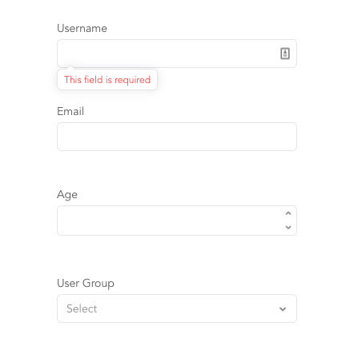

# schema-form

Form generation and validation based on `schema-typed` and `rsiute`.

## Installation

```
npm install @rsuite/schema-form --save
```

## Usage

```js
import SchemaForm from '@rsuite/schema-form';
import { InputNumber, SelectPicker, Schema } from 'rsuite';

const { StringType, NumberType } = Schema.Types;

const Form = SchemaForm([
  {
    key: 'username',
    type: StringType().isRequired('This field is required'),
    label: 'Username'
  },
  {
    key: 'email',
    type: StringType().isEmail('Please enter a valid email address'),
    label: 'Email',
    helpBlock: 'Please enter your company email address'
  },
  {
    key: 'age',
    type: NumberType('Please enter a valid number'),
    componentClass: InputNumber,
    autoComplete: 'off',
    label: 'Age'
  },
  {
    key: 'group',
    type: NumberType(),
    componentClass: SelectPicker,
    style: {
      width: 300
    },
    data: [{ value: 1, label: 'Admin' }, { value: 2, label: 'User' }],
    label: 'User Group'
  }
]);

ReactDOM.render(<Form />, mountNode);
```



## Documentation

- [Form examples](https://rsuitejs.com/en/components/form#Examples)
- [Form props](https://rsuitejs.com/en/components/form#Props)

## License

MIT licensed
